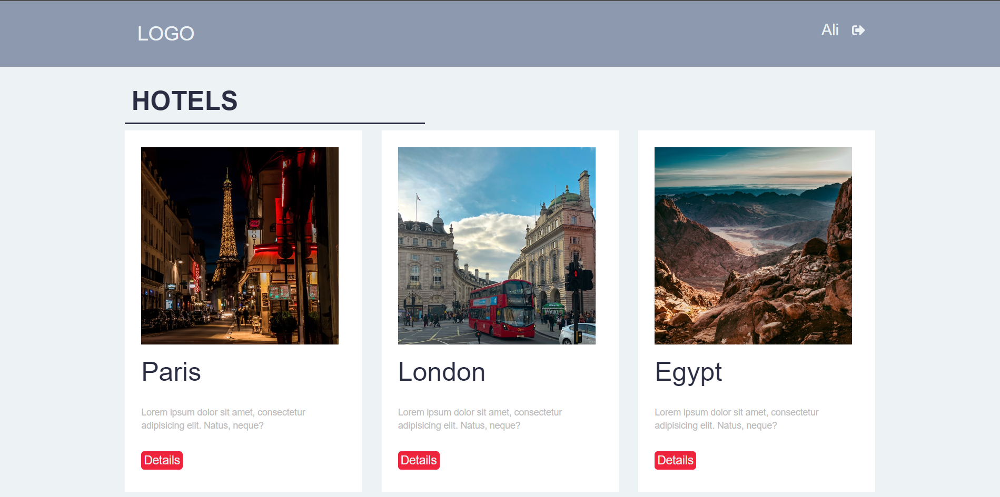
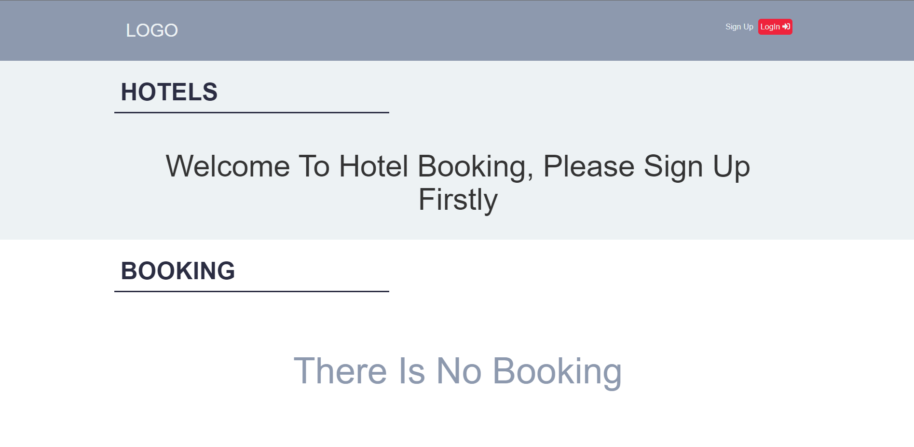
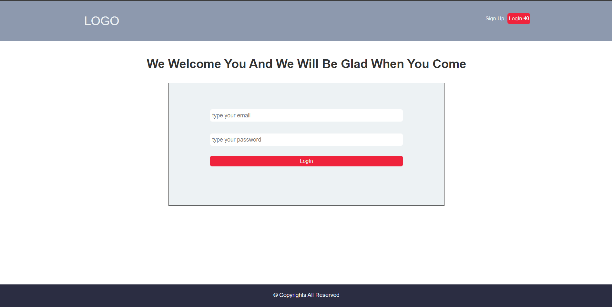
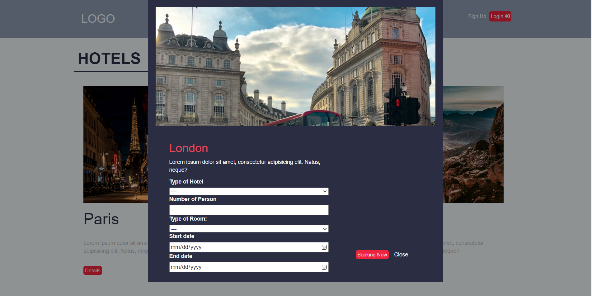
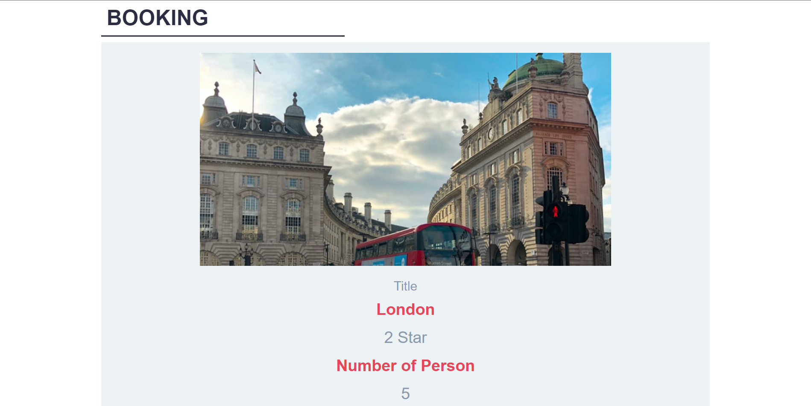

# hotel-booking-js

<h2>About project :- </h2>

Booking project is an app for people who want to book a hotel online to travel 

 
<h2>Technical skills :-</h2>
<ul>
   <li>Bootstrap</li>
   <li>SASS</li>
   <li>JS DOM</li>
</ul>

 

 

 

 

 

<h2>User experience :-</h2>

The users cannot see the hotels unless firstly register
after registraion has authentication they can see all hotels then select on details of any hotel then they will enter data and click on booking now button

